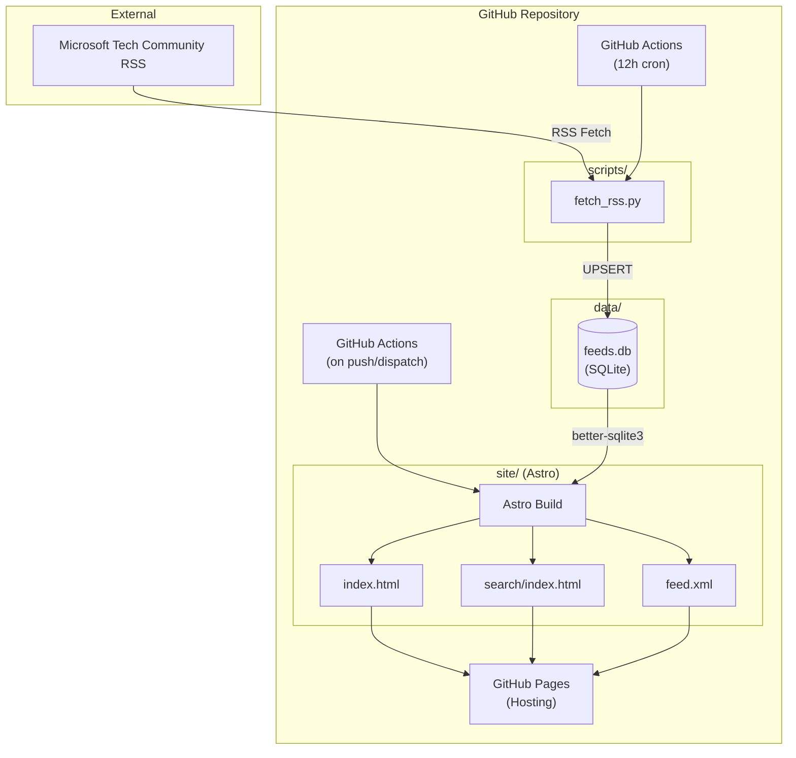
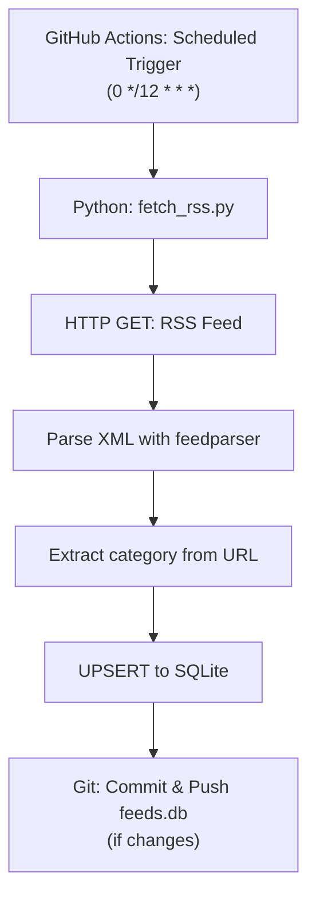
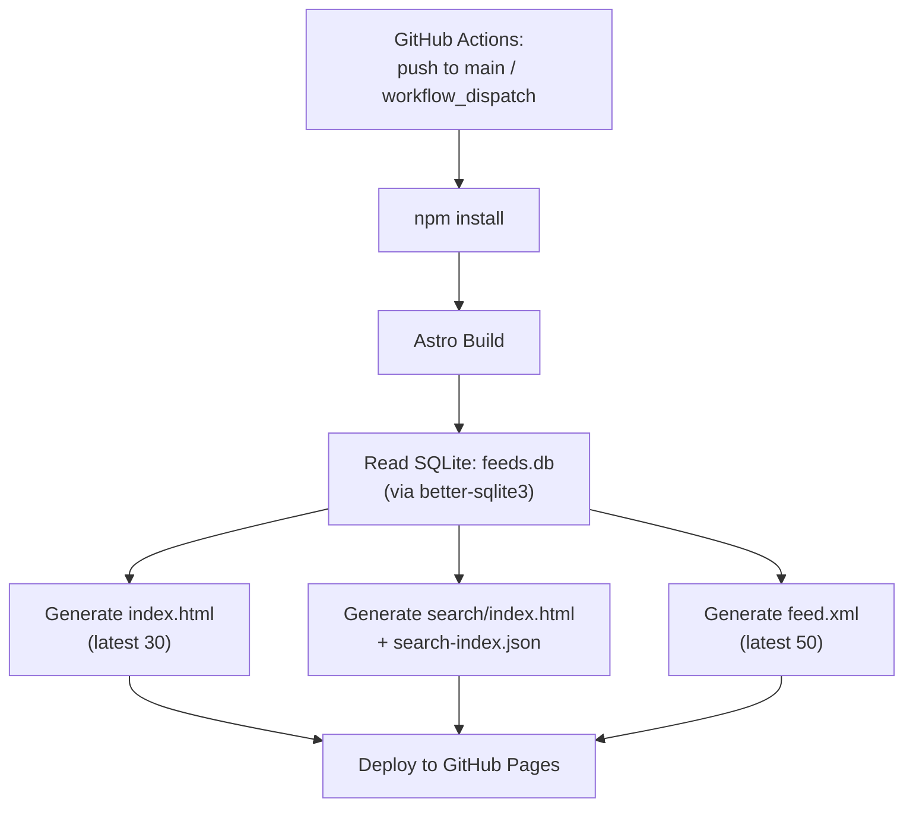

# System Architecture

## 1. System Overview



## 2. Design Principles

### 2.1 Separation of Concerns

| Component      | Responsibility                          | Output                      |
| -------------- | --------------------------------------- | --------------------------- |
| `fetch_rss.py` | Fetch RSS, parse, store to SQLite       | `data/feeds.db` (committed) |
| Astro          | Read SQLite directly, build static site | HTML, RSS feed (generated)  |

### 2.2 Data Flow

```
[fetch_rss.py]                [Astro]
     │                           │
     ▼                           ▼
RSS ──► SQLite (committed) ──► HTML/RSS (deployed)
     │                           │
  12h cron                 on-demand build
                           (reads SQLite directly)
```

**Key Points**:

- Only SQLite is committed to the repository
- No intermediate JSON export step
- Astro reads SQLite directly via `better-sqlite3` at build time
- Static files are generated on-demand during build

## 3. Processing Flow

### 3.1 Data Fetching Flow (Scheduled)



### 3.2 Site Build Flow (On-Demand)



## 4. Technology Stack

### 4.1 Data Fetching & Storage

| Component  | Technology          | Rationale                                         |
| ---------- | ------------------- | ------------------------------------------------- |
| RSS Parser | Python + feedparser | Lightweight, auto-parses RFC 822 / ISO 8601 dates |
| Database   | SQLite              | File-based, Git-manageable, SQL query support     |
| Runtime    | GitHub Actions      | Free, scheduled execution support                 |

### 4.2 Static Site Generation

| Component     | Technology       | Rationale                                         |
| ------------- | ---------------- | ------------------------------------------------- |
| SSG           | Astro            | Modern, fast, native SQLite support via Node.js   |
| SQLite Reader | better-sqlite3   | Synchronous, fast SQLite bindings for Node.js     |
| Templates     | Astro components | Flexible, supports React/Vue/Svelte if needed     |
| Styling       | Tailwind CSS     | Modern, utility-first, built-in Astro integration |
| RSS           | @astrojs/rss     | Built-in RSS feed generation                      |

### 4.3 Client-Side Search

| Component     | Technology         | Rationale                                 |
| ------------- | ------------------ | ----------------------------------------- |
| Search Engine | Pagefind           | Static search, auto-indexes at build time |
| Alternative   | Fuse.js or Lunr.js | Lightweight client-side search            |

### 4.4 Hosting & CI/CD

| Component | Technology     | Rationale                                  |
| --------- | -------------- | ------------------------------------------ |
| Hosting   | GitHub Pages   | Free, automatic HTTPS                      |
| CI/CD     | GitHub Actions | Repository integration, secrets management |

## 5. Directory Structure

```
microsoft-blog-reader/
├── .github/
│   └── workflows/
│       ├── fetch-rss.yml        # RSS fetch workflow (scheduled)
│       └── deploy.yml           # Site build & deploy workflow
├── scripts/
│   └── fetch_rss.py             # RSS fetch & SQLite UPSERT
├── data/
│   └── feeds.db                 # SQLite database (committed)
├── site/                        # Astro project
│   ├── astro.config.mjs         # Astro configuration
│   ├── package.json             # Node.js dependencies
│   ├── tailwind.config.mjs      # Tailwind CSS configuration
│   ├── src/
│   │   ├── layouts/
│   │   │   └── Layout.astro     # Base layout
│   │   ├── pages/
│   │   │   ├── index.astro      # Top page (latest 30)
│   │   │   ├── search.astro     # Search page
│   │   │   └── feed.xml.ts      # RSS feed endpoint
│   │   ├── components/
│   │   │   └── ArticleCard.astro
│   │   └── lib/
│   │       └── db.ts            # SQLite connection helper
│   └── public/
│       └── favicon.ico
├── docs/
│   └── spec/                    # Specifications
├── pyproject.toml               # Python dependencies (uv)
├── requirements.txt             # Python dependencies (pip)
└── README.md
```

## 6. GitHub Actions Workflow Design

### 6.1 fetch-rss.yml

```yaml
name: Fetch RSS

on:
  schedule:
    - cron: "0 */12 * * *" # Every 12 hours (UTC)
  workflow_dispatch: # Manual trigger

jobs:
  fetch:
    runs-on: ubuntu-latest
    permissions:
      contents: write
    steps:
      - uses: actions/checkout@v4

      - uses: actions/setup-python@v5
        with:
          python-version: "3.12"

      - name: Install dependencies
        run: pip install -r requirements.txt

      - name: Fetch RSS and update database
        run: python scripts/fetch_rss.py

      - name: Commit changes
        uses: stefanzweifel/git-auto-commit-action@v5
        with:
          commit_message: "chore: update feeds.db"
          file_pattern: "data/feeds.db"
```

### 6.2 deploy.yml

```yaml
name: Deploy Site

on:
  push:
    branches: [main]
    paths:
      - "data/feeds.db"
      - "site/**"
  workflow_dispatch:

jobs:
  build:
    runs-on: ubuntu-latest
    steps:
      - uses: actions/checkout@v4

      - uses: actions/setup-node@v4
        with:
          node-version: "20"
          cache: "npm"
          cache-dependency-path: site/package-lock.json

      - name: Install dependencies
        run: npm ci
        working-directory: site

      - name: Build site
        run: npm run build
        working-directory: site

      - uses: actions/upload-pages-artifact@v3
        with:
          path: site/dist

  deploy:
    needs: build
    runs-on: ubuntu-latest
    permissions:
      pages: write
      id-token: write
    environment:
      name: github-pages
    steps:
      - uses: actions/deploy-pages@v4
```

## 7. Dependencies

### Python (pyproject.toml / requirements.txt)

```
feedparser>=6.0.0
```

### Node.js (site/package.json)

```json
{
  "dependencies": {
    "astro": "^4.0.0",
    "@astrojs/rss": "^4.0.0",
    "@astrojs/tailwind": "^5.0.0",
    "better-sqlite3": "^11.0.0",
    "tailwindcss": "^3.4.0"
  }
}
```

## 8. SQLite Access Pattern

### 8.1 Database Helper (site/src/lib/db.ts)

```typescript
import Database from "better-sqlite3";
import { join } from "path";

const DB_PATH = join(process.cwd(), "..", "data", "feeds.db");

export function getArticles(limit: number = 30) {
  const db = new Database(DB_PATH, { readonly: true });
  const stmt = db.prepare(`
    SELECT guid, title, link, description, pub_date, author, category
    FROM articles
    ORDER BY pub_date DESC
    LIMIT ?
  `);
  const articles = stmt.all(limit);
  db.close();
  return articles;
}

export function getAllCategories() {
  const db = new Database(DB_PATH, { readonly: true });
  const stmt = db.prepare(`
    SELECT DISTINCT category FROM articles WHERE category IS NOT NULL
  `);
  const categories = stmt.all();
  db.close();
  return categories.map((c) => c.category);
}
```

### 8.2 Usage in Astro Page

```astro
---
// src/pages/index.astro
import { getArticles } from '../lib/db';
import Layout from '../layouts/Layout.astro';
import ArticleCard from '../components/ArticleCard.astro';

const articles = getArticles(30);
---

<Layout title="Microsoft Blog Reader">
  <main>
    {articles.map(article => (
      <ArticleCard article={article} />
    ))}
  </main>
</Layout>
```
