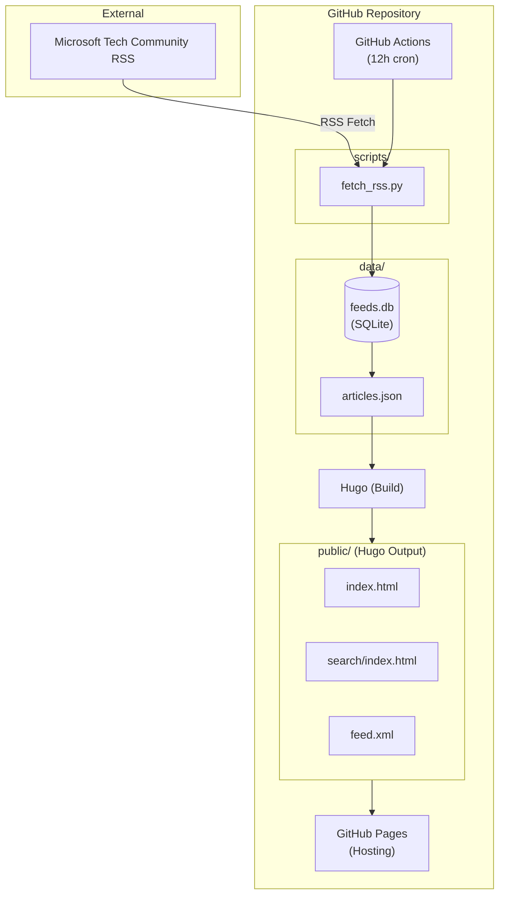
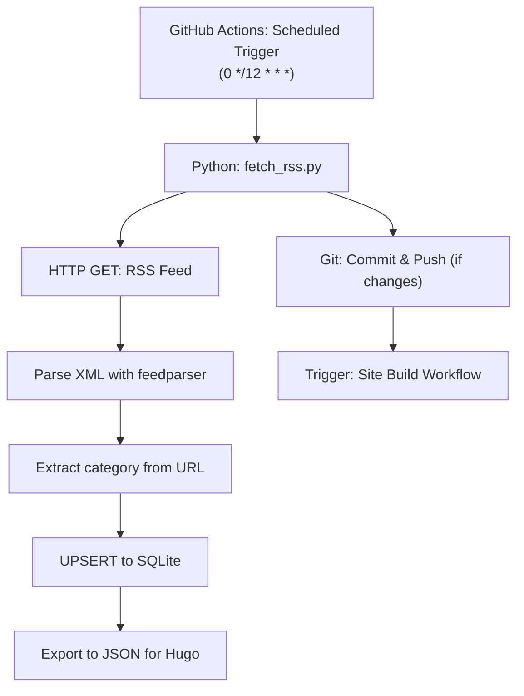
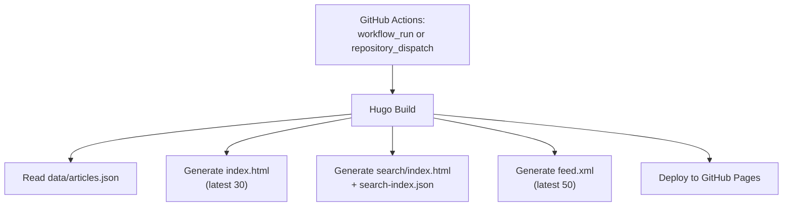

# System Architecture

## 1. System Overview



## 2. Processing Flow

### 2.1 Data Fetching Flow



### 2.2 Site Build Flow



## 3. Technology Stack

### 3.1 Data Fetching & Processing

| Component  | Technology          | Rationale                                         |
| ---------- | ------------------- | ------------------------------------------------- |
| RSS Parser | Python + feedparser | Lightweight, auto-parses RFC 822 / ISO 8601 dates |
| Database   | SQLite              | File-based, Git-manageable, SQL query support     |
| Runtime    | GitHub Actions      | Free, scheduled execution support                 |

### 3.2 Static Site Generation

| Component | Technology                  | Rationale                                            |
| --------- | --------------------------- | ---------------------------------------------------- |
| SSG       | Hugo                        | Fast builds, built-in RSS support, data file support |
| Templates | Go html/template            | Hugo standard                                        |
| Styling   | CSS (Tailwind CSS optional) | Lightweight, easy customization                      |

### 3.3 Client-Side Search

| Component     | Technology                 | Rationale                                     |
| ------------- | -------------------------- | --------------------------------------------- |
| Search Engine | Lunr.js                    | Lightweight, no dependencies, offline capable |
| Index         | Build-time JSON generation | No server required                            |

### 3.4 Hosting & CI/CD

| Component   | Technology                           | Rationale                                  |
| ----------- | ------------------------------------ | ------------------------------------------ |
| Hosting     | GitHub Pages                         | Free, automatic HTTPS                      |
| CI/CD       | GitHub Actions                       | Repository integration, secrets management |
| Auto Commit | stefanzweifel/git-auto-commit-action | Proven, easy configuration                 |

## 4. Directory Structure

```
microsoft-blog-reader/
├── .github/
│   └── workflows/
│       ├── fetch-rss.yml        # RSS fetch workflow
│       └── deploy.yml           # Site deploy workflow
├── scripts/
│   ├── fetch_rss.py             # RSS fetch & DB update script
│   └── requirements.txt         # Python dependencies
├── data/
│   ├── feeds.db                 # SQLite database
│   └── articles.json            # Hugo export data
├── site/                        # Hugo site source
│   ├── config.toml              # Hugo configuration
│   ├── content/
│   ├── layouts/
│   │   ├── index.html           # Top page template
│   │   ├── search/
│   │   │   └── list.html        # Search page template
│   │   └── _default/
│   │       └── rss.xml          # Custom RSS template
│   ├── static/
│   │   └── js/
│   │       └── search.js        # Lunr.js search implementation
│   └── data/ -> ../data/        # Symlink
├── docs/
│   └── spec/                    # Specifications
└── README.md
```

## 5. GitHub Actions Workflow Design

### 5.1 fetch-rss.yml

```yaml
name: Fetch RSS

on:
  schedule:
    - cron: "0 */12 * * *" # Every 12 hours (UTC)
  workflow_dispatch: # Manual trigger enabled

jobs:
  fetch:
    runs-on: ubuntu-latest
    permissions:
      contents: write
    steps:
      - checkout
      - setup-python
      - run: python scripts/fetch_rss.py
      - git-auto-commit (if changes)
      - trigger deploy workflow
```

### 5.2 deploy.yml

```yaml
name: Deploy Site

on:
  workflow_run:
    workflows: ["Fetch RSS"]
    types: [completed]
  push:
    paths:
      - "site/**"
      - "data/articles.json"
  workflow_dispatch:

jobs:
  build:
    runs-on: ubuntu-latest
    steps:
      - checkout
      - setup-hugo
      - hugo build
      - upload-pages-artifact

  deploy:
    needs: build
    runs-on: ubuntu-latest
    steps:
      - deploy-pages
```

## 6. Dependencies

### Python (scripts/requirements.txt)

```
feedparser>=6.0.0
```

### Hugo

- Version: Extended (regular version OK if SCSS not needed)
- Recommended: v0.120.0 or later

### npm (for search functionality, optional)

```
lunr
```
